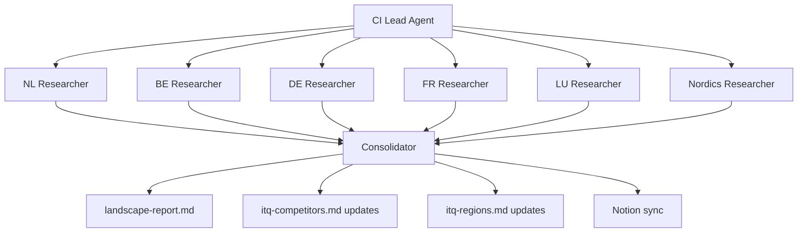

# Cross-Regional Competitive Research Strategy

<aside>
🎯

**Date:** 2026-02-11 | **Status:** Draft — for use in a future project to implement these changes

</aside>

## Problem Statement

ITQ operates across multiple regions (NL, BE, FR, DE, LU, expanding to Nordics) with five service lines (Hybrid Cloud, Cloud Native, Digital Workspace, Managed Services, Licensing Advisory). The current virtual agent team produces competitive research per proposition pipeline, but lacks:

1. **No region x competitor matrix** — cannot see "who competes with us in Belgium vs. Germany vs. Nordics"
2. **No regional market dynamics** — partner ecosystems, procurement norms, and regulatory pressure vary by country
3. **Research not reusable across propositions** — intelligence discovered during one project doesn't automatically feed into others (e.g., Arctic Wolf expanding in DE found during Cyber Resilience doesn't reach Hybrid Cloud pipeline)

---

## Current State

### How competitive research works today

| Step | Agent | What happens |
| --- | --- | --- |
| 1 | Product Manager | Creates VPC with competitive positioning (top 3 competitors per service line) |
| 2 | Architect | References [`itq-competitors.md`](http://itq-competitors.md) for competitor technology stacks |
| 3 | CTO | Reviews competitive threats, flags research priorities for downstream |
| 4 | Sales Enablement | Creates per-competitor battle cards using [`itq-competitors.md`](http://itq-competitors.md)  • CTO instructions |
| 5 | Researcher | Conducts real-time research via Perplexity; compares against skill file baseline; flags changes |

### Current skill file structure

- [`itq-competitors.md`](http://itq-competitors.md) — Flat table of 15+ competitors. HQ noted but no structured regional breakdown. Battle cards for top 3 only.
- [`itq-market-intelligence.md`](http://itq-market-intelligence.md) — Tagged by proposition but not systematically by region x competitor.
- [`itq-regulations.md`](http://itq-regulations.md) — Has per-country NIS2 transposition status but not linked to competitive dynamics.

### Key limitation

The Researcher agent treats [`itq-competitors.md`](http://itq-competitors.md) as a baseline and researches what changed since. But the baseline itself has no regional depth — it's Netherlands-centric with occasional mentions of other markets.

---

## Recommended Changes

### Change 1: Restructure [`itq-competitors.md`](http://itq-competitors.md) to be region-aware

Add a **Regional Presence** section per competitor profile:

```
## PQR (Bechtle Group)
...existing fields...

### Regional Presence
| Region | Active | Partner Tier | Vertical Focus | Notable Wins | Threat Level |
|--------|--------|-------------|----------------|--------------|--------------|  
| NL     | Yes    | Pinnacle    | Gov, Healthcare| Gemeente X   | High         |
| BE     | Yes    | Pinnacle    | Healthcare     | -            | Medium       |
| DE     | Via Bechtle | -       | Enterprise     | -            | Low          |
| FR     | No     | -           | -              | -            | None         |
```

Add a **Regional Competitive Landscape** summary matrix at the end of the file:

```
| Region  | Hybrid Cloud             | Digital Workspace | Cloud Native       | Managed Services    | Cyber Resilience                    |
|---------|--------------------------|-------------------|--------------------|---------------------|-------------------------------------|
| NL      | PQR, SLTN, Computacenter | PQR, SLTN         | Nordcloud, Sentia  | SLTN, Open Line     | Arctic Wolf, Eye Security, ON2IT    |
| BE      | Axians, Computacenter    | Axians            | Sentia             | Open Line (Conscia) | Eye Security                        |
| DE      | Computacenter, Atos      | Computacenter     | Nordcloud          | Atos                | Arctic Wolf                         |
| FR      | Axians, Atos             | -                 | -                  | Axians              | -                                   |
| LU      | -                        | -                 | -                  | -                   | -                                   |
| Nordics | Nordcloud, Proact        | -                 | Nordcloud          | Proact              | Arctic Wolf                         |
```

---

### Change 2: Create a new [`itq-regions.md`](http://itq-regions.md) skill file

A dedicated knowledge file containing per-region context that all agents need. Structure per region:

<aside>
📌

For each region: Market characteristics (size, maturity, procurement culture), ITQ presence (office, headcount, partnerships), Regulatory environment (NIS2 status, local certifications), Key verticals, Go-to-market approach (direct vs. channel, tender vs. relationship)

</aside>

**Regions to cover:**

| Region | Priority | Data Availability | Notes |
| --- | --- | --- | --- |
| NL | High | Strong | HQ market, most data available, strong customer references |
| BE | High | Medium | NIS2 in force since April 2025 — compliance demand pull |
| DE | Medium | Low | Large market, different competitive dynamics |
| FR | Medium | Low | Language and procurement culture differences |
| LU | Low | Low | Smaller market, financial sector focus |
| Nordics | Low | Minimal | Expansion target — heavier on market entry considerations |

This file becomes a dependency for the Researcher, Sales Enablement, and Marketeer agents.

---

### Change 3: Add a standalone Competitive Landscape Sweep workflow

Currently, competitive intel only appears as a by-product of proposition pipelines (step 06). Add a periodic, standalone research workflow.

#### Option A: Manual orchestration (simplest)

Run the Researcher agent in utility mode once per region:

```
/agent researcher "Conduct competitive landscape update for region: {NL}.
For each competitor active in this region, research:
- Recent wins/losses
- Funding, M&A activity
- New partnerships or certifications
- Pricing changes
- Positioning shifts
- New service launches
Cross-reference with itq-competitors.md baseline.
Output to output/competitive-intel/{region}-{date}.md"
```

Repeat for BE, DE, FR, LU, Nordics. Then manually consolidate.

**Pros:** No agent changes needed, works today.

**Cons:** Sequential, no automatic consolidation, no skill file updates.

#### Option B: Parallel agent sweep (recommended)

Use a team of Researcher agents running in parallel, one per region, with a consolidation step:



**Pros:** Parallel execution, automatic consolidation, skill file feedback loop.

**Cons:** Requires new agent definition or orchestration logic.

#### Option C: Region x Proposition matrix (most thorough)

Run researchers per cell: `{region} x {proposition}`. For 6 regions and 5 propositions = 30 cells. Pre-filter to active combinations only.

**Pros:** Maximum granularity, proposition-specific competitive insights per region.

**Cons:** Expensive (30 research runs), many cells will be sparse. Better for a later stage.

---

## Implementation Roadmap

### Phase 1: Foundation

- [ ]  **Create [`itq-regions.md`](http://itq-regions.md)** — Populate with known regional data from existing skill files, Notion, and team knowledge. Start with NL and BE.
- [ ]  **Restructure [`itq-competitors.md`](http://itq-competitors.md)** — Add Regional Presence tables per competitor. Add the Regional Competitive Landscape summary matrix. Additive change, no data lost.
- [ ]  **Update agent references** — Ensure Researcher, Sales Enablement, and Marketeer agents read [`itq-regions.md`](http://itq-regions.md) in their context.

### Phase 2: Workflow

- [ ]  **Run a manual sweep (Option A)** — Execute one round of region-by-region research to validate the approach and populate the new data structures.
- [ ]  **Review and refine** — Check output quality. Adjust Researcher prompt based on results.

### Phase 3: Automation

- [ ]  **Build the parallel sweep (Option B)** — Create orchestration logic for periodic competitive landscape sweeps.
- [ ]  **Establish cadence** — Run quarterly or on-demand before major GTM decisions.
- [ ]  **Add Notion sync** — Ensure sweep outputs feed back into the Market Intelligence DB with proper region and proposition tags.

---

## Agent Changes Required

| Agent | Change | Priority |
| --- | --- | --- |
| Researcher | Add [`itq-regions.md`](http://itq-regions.md) to context. Update prompt to check regional presence when researching competitors. | High |
| Sales Enablement | Add [`itq-regions.md`](http://itq-regions.md) to context. Create region-specific battle cards when CTO specifies a target region. | Medium |
| Marketeer | Add [`itq-regions.md`](http://itq-regions.md) to context. Adapt campaign plans for regional differences (language, regulatory urgency, channel mix). | Medium |
| Product Manager | Reference [`itq-regions.md`](http://itq-regions.md) when building VPC to segment customer profiles by region. | Low |
| New: CI Lead (optional) | Orchestrates parallel competitive sweeps. Consolidates regional outputs. Proposes skill file updates. | Phase 3 |

---

## Success Criteria

- [ ]  Can answer "Who are our top 3 competitors in Belgium for Managed Services?" from skill files alone (no research needed)
- [ ]  Researcher agent produces region-tagged competitive intelligence that is reusable across proposition pipelines
- [ ]  Quarterly competitive landscape report covers all active regions
- [ ]  Skill files ([`itq-competitors.md`](http://itq-competitors.md), [`itq-regions.md`](http://itq-regions.md)) stay current through a feedback loop from research outputs
- [ ]  New proposition pipelines start with fresher, region-aware competitive baselines